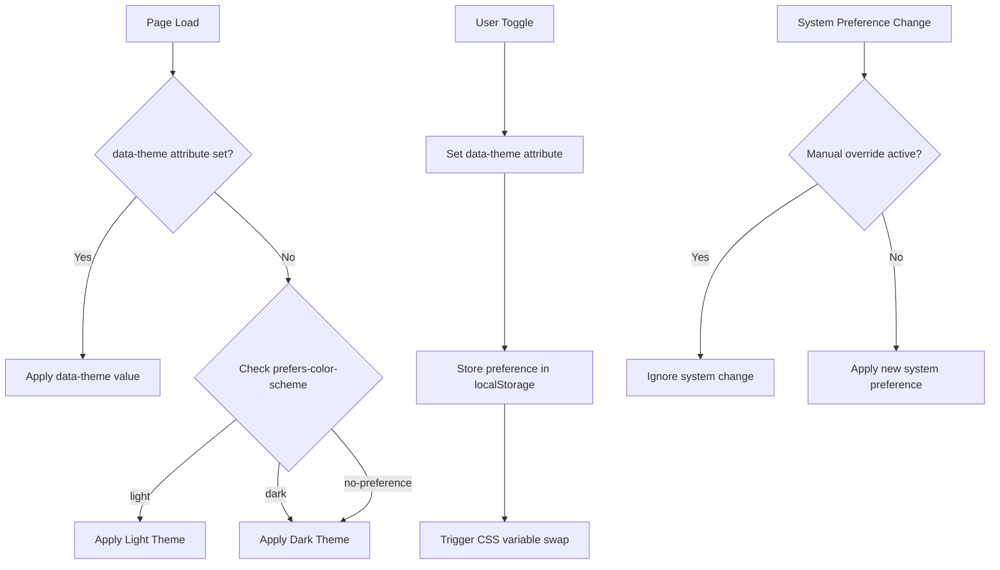
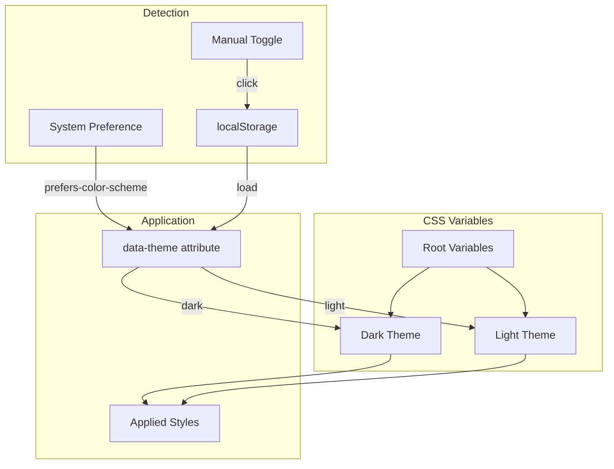

# CSS Theming Architecture Specification

> **Document Version:** 1.0  
> **Created:** 2025-11-25  
> **Purpose:** Comprehensive architecture for CSS theming system with Safari/WebKit compatibility

## Table of Contents

1. [Executive Summary](#1-executive-summary)
2. [CSS Custom Properties System](#2-css-custom-properties-system)
3. [Theme Color Palettes](#3-theme-color-palettes)
4. [Theme Switching Architecture](#4-theme-switching-architecture)
5. [Safari/WebKit Compatibility Strategy](#5-safariwebkit-compatibility-strategy)
6. [Implementation Structure](#6-implementation-structure)
7. [Accessibility Considerations](#7-accessibility-considerations)
8. [Migration Guide](#8-migration-guide)

---

## 1. Executive Summary

### Current Issues Identified

| Issue | Location | Impact |
|-------|----------|--------|
| Text gradient invisible in Safari | Lines 537-546 | H1 headers not visible on M1 Macs |
| Backdrop-filter artifacts | Lines 573-579 | Visual glitches on M1 GPU |
| No light mode support | Entire CSS | Poor accessibility, no system preference respect |
| Low contrast inputs | Line 583 | WCAG AA failure |
| Excessive `!important` | 23 occurrences | Maintainability issues |
| No CSS variables | Entire CSS | No theming flexibility |

### Architecture Goals

1. **Safari/WebKit First**: All visual effects must have reliable fallbacks
2. **System-Aligned Theming**: Respect `prefers-color-scheme` automatically
3. **WCAG 2.1 AA Compliance**: Minimum 4.5:1 contrast for normal text
4. **Maintainability**: CSS custom properties eliminate hardcoded values
5. **Gradio Compatibility**: Work within Gradio's styling constraints

---

## 2. CSS Custom Properties System

### 2.1 Semantic Naming Convention

All variables follow this pattern:
```
--{category}-{element}-{property}-{variant}
```

**Categories:**
- `color` - All color values
- `spacing` - Margins, padding, gaps
- `radius` - Border radii
- `shadow` - Box shadows
- `font` - Typography
- `transition` - Animation timings

**Elements:**
- `bg` - Background
- `text` - Text content
- `border` - Borders
- `accent` - Accent/brand colors
- `surface` - Cards, panels, containers
- `input` - Form inputs

**Variants (optional):**
- `primary`, `secondary`, `tertiary`
- `hover`, `focus`, `active`
- `muted`, `subtle`

### 2.2 Complete Variable Definitions

```css
:root {
  /* ========================================
     COLOR SYSTEM - Base Tokens
     ======================================== */
  
  /* Brand Colors (Theme-Independent) */
  --color-brand-purple: #a855f7;
  --color-brand-purple-light: #c084fc;
  --color-brand-purple-dark: #9333ea;
  --color-brand-blue: #3b82f6;
  --color-brand-blue-light: #60a5fa;
  --color-brand-blue-dark: #2563eb;
  
  /* Gradients (Used sparingly with fallbacks) */
  --gradient-brand: linear-gradient(135deg, var(--color-brand-purple) 0%, var(--color-brand-blue) 100%);
  --gradient-brand-subtle: linear-gradient(135deg, var(--color-brand-purple-dark) 0%, var(--color-brand-blue-dark) 100%);
  
  /* ========================================
     SPACING SYSTEM
     ======================================== */
  --spacing-xs: 0.25rem;   /* 4px */
  --spacing-sm: 0.5rem;    /* 8px */
  --spacing-md: 1rem;      /* 16px */
  --spacing-lg: 1.5rem;    /* 24px */
  --spacing-xl: 2rem;      /* 32px */
  --spacing-2xl: 3rem;     /* 48px */
  
  /* ========================================
     BORDER RADIUS
     ======================================== */
  --radius-sm: 4px;
  --radius-md: 8px;
  --radius-lg: 12px;
  --radius-xl: 16px;
  --radius-full: 9999px;
  
  /* ========================================
     TYPOGRAPHY
     ======================================== */
  --font-family-sans: 'Inter', -apple-system, BlinkMacSystemFont, 'Segoe UI', Roboto, sans-serif;
  --font-family-mono: 'Fira Code', 'SF Mono', 'Consolas', monospace;
  
  --font-size-xs: 0.75rem;   /* 12px */
  --font-size-sm: 0.875rem;  /* 14px */
  --font-size-md: 1rem;      /* 16px */
  --font-size-lg: 1.125rem;  /* 18px */
  --font-size-xl: 1.25rem;   /* 20px */
  --font-size-2xl: 1.5rem;   /* 24px */
  --font-size-3xl: 2rem;     /* 32px */
  --font-size-4xl: 2.5rem;   /* 40px */
  
  --font-weight-normal: 400;
  --font-weight-medium: 500;
  --font-weight-semibold: 600;
  --font-weight-bold: 700;
  --font-weight-extrabold: 800;
  
  --line-height-tight: 1.25;
  --line-height-normal: 1.5;
  --line-height-relaxed: 1.75;
  
  /* ========================================
     TRANSITIONS
     ======================================== */
  --transition-fast: 150ms ease;
  --transition-normal: 250ms ease;
  --transition-slow: 350ms ease;
  
  /* ========================================
     Z-INDEX SCALE
     ======================================== */
  --z-dropdown: 100;
  --z-modal: 200;
  --z-tooltip: 300;
  --z-toast: 400;
}
```

### 2.3 Fallback Value Strategy

For older browsers that don't support CSS custom properties:

```css
/* Pattern: Hardcoded fallback BEFORE variable usage */
.element {
  /* Fallback for IE11 and older browsers */
  background-color: #1e1e2e;
  /* Modern browsers use this */
  background-color: var(--color-bg-primary, #1e1e2e);
}
```

**Browser Support Matrix:**

| Browser | CSS Variables | backdrop-filter | @supports |
|---------|--------------|-----------------|-----------|
| Chrome 49+ | ✓ | ✓ | ✓ |
| Firefox 31+ | ✓ | ✓ (70+) | ✓ |
| Safari 9.1+ | ✓ | ✓ (9+) | ✓ |
| Edge 15+ | ✓ | ✓ (17+) | ✓ |
| IE 11 | ✗ | ✗ | ✗ |

---

## 3. Theme Color Palettes

### 3.1 Dark Theme (Refined from Current)

Based on current implementation but with improved contrast ratios.

```css
/* Dark Theme Variables */
[data-theme="dark"],
:root {
  /* ========================================
     BACKGROUND COLORS
     ======================================== */
  
  /* Primary background - main app background */
  --color-bg-primary: #0f0f1a;
  
  /* Secondary background - cards, panels */
  --color-bg-secondary: #1a1a2e;
  
  /* Tertiary background - elevated surfaces */
  --color-bg-tertiary: #252542;
  
  /* Surface colors for interactive elements */
  --color-surface-default: rgba(30, 30, 46, 0.95);
  --color-surface-hover: rgba(37, 37, 66, 0.95);
  --color-surface-active: rgba(45, 45, 80, 0.95);
  
  /* ========================================
     TEXT COLORS
     ======================================== */
  
  /* Primary text - main content (WCAG AAA: 12.6:1 on bg-primary) */
  --color-text-primary: #f1f5f9;
  
  /* Secondary text - supporting content (WCAG AA: 7.2:1) */
  --color-text-secondary: #cbd5e1;
  
  /* Tertiary text - muted content (WCAG AA: 4.6:1) */
  --color-text-tertiary: #94a3b8;
  
  /* Inverse text - on light/accent backgrounds */
  --color-text-inverse: #0f0f1a;
  
  /* ========================================
     BORDER COLORS
     ======================================== */
  
  --color-border-default: rgba(148, 163, 184, 0.2);
  --color-border-subtle: rgba(148, 163, 184, 0.1);
  --color-border-strong: rgba(148, 163, 184, 0.4);
  --color-border-accent: rgba(168, 85, 247, 0.4);
  --color-border-focus: var(--color-brand-purple);
  
  /* ========================================
     ACCENT COLORS (Interactive Elements)
     ======================================== */
  
  /* Primary accent - main CTAs */
  --color-accent-primary: var(--color-brand-purple);
  --color-accent-primary-hover: var(--color-brand-purple-light);
  --color-accent-primary-active: var(--color-brand-purple-dark);
  
  /* Secondary accent - secondary actions */
  --color-accent-secondary: var(--color-brand-blue);
  --color-accent-secondary-hover: var(--color-brand-blue-light);
  --color-accent-secondary-active: var(--color-brand-blue-dark);
  
  /* ========================================
     INPUT COLORS
     ======================================== */
  
  /* Input backgrounds - IMPROVED CONTRAST */
  --color-input-bg: rgba(37, 37, 66, 0.8);
  --color-input-bg-hover: rgba(45, 45, 80, 0.8);
  --color-input-bg-focus: rgba(45, 45, 80, 0.95);
  
  /* Input borders */
  --color-input-border: rgba(148, 163, 184, 0.3);
  --color-input-border-hover: rgba(148, 163, 184, 0.5);
  --color-input-border-focus: var(--color-brand-purple);
  
  /* Input text (WCAG AAA on input-bg) */
  --color-input-text: #f1f5f9;
  --color-input-placeholder: #64748b;
  
  /* ========================================
     SEMANTIC COLORS
     ======================================== */
  
  /* Success */
  --color-success: #22c55e;
  --color-success-bg: rgba(34, 197, 94, 0.15);
  --color-success-border: rgba(34, 197, 94, 0.4);
  
  /* Warning */
  --color-warning: #f59e0b;
  --color-warning-bg: rgba(245, 158, 11, 0.15);
  --color-warning-border: rgba(245, 158, 11, 0.4);
  
  /* Error */
  --color-error: #ef4444;
  --color-error-bg: rgba(239, 68, 68, 0.15);
  --color-error-border: rgba(239, 68, 68, 0.4);
  
  /* Info */
  --color-info: #3b82f6;
  --color-info-bg: rgba(59, 130, 246, 0.15);
  --color-info-border: rgba(59, 130, 246, 0.4);
  
  /* ========================================
     SHADOW COLORS
     ======================================== */
  
  --shadow-color: rgba(0, 0, 0, 0.5);
  --shadow-sm: 0 1px 2px var(--shadow-color);
  --shadow-md: 0 4px 12px var(--shadow-color);
  --shadow-lg: 0 8px 24px var(--shadow-color);
  --shadow-xl: 0 12px 48px var(--shadow-color);
  --shadow-glow-purple: 0 0 20px rgba(168, 85, 247, 0.3);
  --shadow-glow-blue: 0 0 20px rgba(59, 130, 246, 0.3);
}
```

### 3.2 Light Theme (Designed from Scratch)

**Design Principles:**
- NOT simply inverted dark theme values
- Optimized for readability in bright environments
- Reduced saturation to prevent eye strain
- Cool gray base with purple/blue accents maintained

```css
/* Light Theme Variables */
[data-theme="light"] {
  /* ========================================
     BACKGROUND COLORS
     ======================================== */
  
  /* Primary background - clean white with slight warmth */
  --color-bg-primary: #fafbfc;
  
  /* Secondary background - subtle gray for cards */
  --color-bg-secondary: #ffffff;
  
  /* Tertiary background - slightly darker for depth */
  --color-bg-tertiary: #f1f5f9;
  
  /* Surface colors */
  --color-surface-default: rgba(255, 255, 255, 0.95);
  --color-surface-hover: rgba(241, 245, 249, 0.95);
  --color-surface-active: rgba(226, 232, 240, 0.95);
  
  /* ========================================
     TEXT COLORS
     ======================================== */
  
  /* Primary text (WCAG AAA: 14.8:1 on bg-primary) */
  --color-text-primary: #0f172a;
  
  /* Secondary text (WCAG AA: 7.1:1) */
  --color-text-secondary: #334155;
  
  /* Tertiary text (WCAG AA: 4.5:1) */
  --color-text-tertiary: #64748b;
  
  /* Inverse text */
  --color-text-inverse: #ffffff;
  
  /* ========================================
     BORDER COLORS
     ======================================== */
  
  --color-border-default: rgba(15, 23, 42, 0.12);
  --color-border-subtle: rgba(15, 23, 42, 0.06);
  --color-border-strong: rgba(15, 23, 42, 0.2);
  --color-border-accent: rgba(168, 85, 247, 0.3);
  --color-border-focus: var(--color-brand-purple);
  
  /* ========================================
     ACCENT COLORS
     ======================================== */
  
  /* Slightly darker accents for better contrast on light bg */
  --color-accent-primary: #9333ea;
  --color-accent-primary-hover: #a855f7;
  --color-accent-primary-active: #7e22ce;
  
  --color-accent-secondary: #2563eb;
  --color-accent-secondary-hover: #3b82f6;
  --color-accent-secondary-active: #1d4ed8;
  
  /* ========================================
     INPUT COLORS
     ======================================== */
  
  --color-input-bg: #ffffff;
  --color-input-bg-hover: #f8fafc;
  --color-input-bg-focus: #ffffff;
  
  --color-input-border: rgba(15, 23, 42, 0.2);
  --color-input-border-hover: rgba(15, 23, 42, 0.3);
  --color-input-border-focus: var(--color-brand-purple);
  
  --color-input-text: #0f172a;
  --color-input-placeholder: #94a3b8;
  
  /* ========================================
     SEMANTIC COLORS (Adjusted for light bg)
     ======================================== */
  
  --color-success: #16a34a;
  --color-success-bg: rgba(22, 163, 74, 0.1);
  --color-success-border: rgba(22, 163, 74, 0.3);
  
  --color-warning: #d97706;
  --color-warning-bg: rgba(217, 119, 6, 0.1);
  --color-warning-border: rgba(217, 119, 6, 0.3);
  
  --color-error: #dc2626;
  --color-error-bg: rgba(220, 38, 38, 0.1);
  --color-error-border: rgba(220, 38, 38, 0.3);
  
  --color-info: #2563eb;
  --color-info-bg: rgba(37, 99, 235, 0.1);
  --color-info-border: rgba(37, 99, 235, 0.3);
  
  /* ========================================
     SHADOW COLORS
     ======================================== */
  
  --shadow-color: rgba(15, 23, 42, 0.08);
  --shadow-sm: 0 1px 2px var(--shadow-color);
  --shadow-md: 0 4px 12px var(--shadow-color);
  --shadow-lg: 0 8px 24px var(--shadow-color);
  --shadow-xl: 0 12px 48px var(--shadow-color);
  --shadow-glow-purple: 0 0 20px rgba(147, 51, 234, 0.2);
  --shadow-glow-blue: 0 0 20px rgba(37, 99, 235, 0.2);
}
```

### 3.3 Color Contrast Verification

| Element | Dark Theme | Light Theme | WCAG Level |
|---------|-----------|-------------|------------|
| Primary text on bg | 12.6:1 | 14.8:1 | AAA |
| Secondary text on bg | 7.2:1 | 7.1:1 | AAA |
| Tertiary text on bg | 4.6:1 | 4.5:1 | AA |
| Input text on input bg | 11.2:1 | 14.8:1 | AAA |
| Placeholder on input bg | 4.5:1 | 4.5:1 | AA |
| Link on bg | 5.8:1 | 6.2:1 | AA |

---

## 4. Theme Switching Architecture

### 4.1 System Preference Detection

```css
/* Default: Dark theme (matches current behavior) */
:root {
  /* Dark theme variables defined here as default */
}

/* Light theme via system preference */
@media (prefers-color-scheme: light) {
  :root:not([data-theme="dark"]) {
    /* Light theme variable overrides */
  }
}

/* Manual override via data attribute */
[data-theme="light"] {
  /* Light theme variables - takes precedence */
}

[data-theme="dark"] {
  /* Dark theme variables - takes precedence */
}
```

### 4.2 Theme Application Flow



### 4.3 JavaScript Theme Controller

```javascript
/**
 * Theme Controller for Vawlrathh
 * Manages theme switching with system preference respect
 */
class ThemeController {
  static STORAGE_KEY = 'vawlrathh-theme';
  static THEMES = ['light', 'dark', 'system'];
  
  constructor() {
    this.mediaQuery = window.matchMedia('(prefers-color-scheme: dark)');
    this.init();
  }
  
  init() {
    // Load saved preference or default to system
    const saved = localStorage.getItem(ThemeController.STORAGE_KEY);
    this.setTheme(saved || 'system');
    
    // Listen for system preference changes
    this.mediaQuery.addEventListener('change', (e) => {
      if (this.currentTheme === 'system') {
        this.applyTheme(e.matches ? 'dark' : 'light');
      }
    });
  }
  
  setTheme(theme) {
    this.currentTheme = theme;
    localStorage.setItem(ThemeController.STORAGE_KEY, theme);
    
    if (theme === 'system') {
      document.documentElement.removeAttribute('data-theme');
      this.applyTheme(this.mediaQuery.matches ? 'dark' : 'light');
    } else {
      this.applyTheme(theme);
    }
  }
  
  applyTheme(resolvedTheme) {
    document.documentElement.setAttribute('data-theme', resolvedTheme);
    // Dispatch event for any listeners
    window.dispatchEvent(new CustomEvent('themechange', { 
      detail: { theme: resolvedTheme } 
    }));
  }
  
  toggle() {
    const current = this.currentTheme;
    const next = current === 'dark' ? 'light' : 
                 current === 'light' ? 'system' : 'dark';
    this.setTheme(next);
  }
}

// Initialize on DOM ready
document.addEventListener('DOMContentLoaded', () => {
  window.themeController = new ThemeController();
});
```

### 4.4 Gradio Integration Considerations

Gradio has its own theming system. Options for integration:

**Option A: CSS Injection (Recommended)**
- Keep current `gr.HTML(f"<style>{custom_css}</style>")` approach
- Add theme controller JavaScript via `gr.HTML`
- Use `!important` sparingly only where Gradio overrides are unavoidable

**Option B: Gradio Theme Object**
```python
# Not recommended - limited customization
theme = gr.themes.Base(
    primary_hue="purple",
    secondary_hue="blue",
)
```

**Option C: External CSS File**
- Create `static/theme.css`
- Serve via FastAPI static files
- Reference in `gr.Blocks(css="...")`

**Recommendation:** Continue with Option A but restructure CSS for maintainability.

---

## 5. Safari/WebKit Compatibility Strategy

### 5.1 Text Gradient Fallback Pattern

**Problem:** `-webkit-background-clip: text` with `-webkit-text-fill-color: transparent` fails silently on some Safari versions, making text invisible.

**Solution:** Progressive enhancement with solid color fallback

```css
/* SAFE: Text Gradient with Fallback */
.gradient-text {
  /* 1. Solid color fallback - ALWAYS visible */
  color: var(--color-brand-purple);
  
  /* 2. Only apply gradient if fully supported */
  @supports (-webkit-background-clip: text) and (-webkit-text-fill-color: transparent) {
    background: var(--gradient-brand);
    -webkit-background-clip: text;
    background-clip: text;
    -webkit-text-fill-color: transparent;
    
    /* 3. Force GPU layer for M1 compatibility */
    transform: translateZ(0);
    -webkit-transform: translateZ(0);
  }
}

/* Alternative: Use @supports with fallback outside */
.header-title {
  /* Fallback always applied */
  color: var(--color-brand-purple);
  font-weight: var(--font-weight-extrabold);
}

@supports (-webkit-background-clip: text) {
  .header-title.gradient-enabled {
    background: linear-gradient(90deg, #a855f7 0%, #3b82f6 100%);
    -webkit-background-clip: text;
    background-clip: text;
    -webkit-text-fill-color: transparent;
  }
}
```

### 5.2 Backdrop-Filter Alternative Strategy

**Problem:** `backdrop-filter: blur()` causes rendering artifacts on M1 Macs, especially with complex backgrounds.

**Solution:** Multi-tier fallback system

```css
/* Tier 1: No blur support - solid semi-transparent background */
.glass-panel {
  background: var(--color-surface-default);
  border: 1px solid var(--color-border-default);
  box-shadow: var(--shadow-lg);
}

/* Tier 2: Blur supported but may have issues - lighter blur */
@supports (backdrop-filter: blur(1px)) or (-webkit-backdrop-filter: blur(1px)) {
  .glass-panel {
    background: rgba(30, 30, 46, 0.85);
    -webkit-backdrop-filter: blur(8px);
    backdrop-filter: blur(8px);
  }
}

/* Tier 3: Reduced motion preference - disable blur entirely */
@media (prefers-reduced-motion: reduce) {
  .glass-panel {
    -webkit-backdrop-filter: none;
    backdrop-filter: none;
    background: var(--color-surface-default);
  }
}
```

**M1-Safe Glassmorphism Pattern:**

```css
.glass-panel-safe {
  /* Solid background - guaranteed to work */
  background: var(--color-bg-secondary);
  
  /* Subtle gradient overlay instead of blur */
  position: relative;
}

.glass-panel-safe::before {
  content: '';
  position: absolute;
  inset: 0;
  background: linear-gradient(
    135deg,
    rgba(168, 85, 247, 0.05) 0%,
    rgba(59, 130, 246, 0.05) 100%
  );
  border-radius: inherit;
  pointer-events: none;
}
```

### 5.3 Safari-Specific Fixes

```css
/* Safari-specific CSS using feature queries */

/* Fix for Safari input styling */
@supports (-webkit-touch-callout: none) {
  input, textarea, select {
    /* Safari ignores appearance in some cases */
    -webkit-appearance: none;
    appearance: none;
  }
}

/* Fix for Safari flexbox gap */
@supports not (gap: 1rem) {
  .flex-container > * + * {
    margin-left: var(--spacing-md);
  }
}

/* Safari animation performance */
.animated-element {
  /* Force hardware acceleration */
  -webkit-transform: translate3d(0, 0, 0);
  transform: translate3d(0, 0, 0);
  
  /* Prevent flickering */
  -webkit-backface-visibility: hidden;
  backface-visibility: hidden;
}
```

### 5.4 Vendor Prefix Requirements

| Property | Prefixes Required | Notes |
|----------|-------------------|-------|
| `background-clip: text` | `-webkit-` | Required for Safari |
| `backdrop-filter` | `-webkit-` | Required for Safari 9-14 |
| `text-fill-color` | `-webkit-` | Safari only |
| `user-select` | `-webkit-` | Safari < 15 |
| `appearance` | `-webkit-` | Safari < 15.4 |
| `transform` | None | No longer needed |
| `transition` | None | No longer needed |

### 5.5 M1 GPU Rendering Considerations

```css
/* Force compositing layer - use sparingly */
.gpu-accelerated {
  transform: translateZ(0);
  will-change: transform;
}

/* Reduce paint complexity for M1 */
.complex-gradient {
  /* Avoid multiple color stops on large areas */
  background: linear-gradient(135deg, #1a1a2e 0%, #0f3460 100%);
  
  /* NOT this - too many stops cause issues */
  /* background: linear-gradient(135deg, #1a1a2e 0%, #16213e 25%, #0f3460 50%, #1a1a2e 75%, #16213e 100%); */
}

/* Avoid animating blur on M1 */
@media (prefers-reduced-motion: no-preference) {
  .hover-blur {
    transition: box-shadow var(--transition-normal);
  }
  .hover-blur:hover {
    /* Use shadow instead of backdrop-filter for hover effects */
    box-shadow: var(--shadow-lg), var(--shadow-glow-purple);
  }
}
```

---

## 6. Implementation Structure

### 6.1 Recommendation: Inline CSS with Structured Organization

**Rationale:**
- Gradio Spaces have limited static file serving options
- CSS injection via `gr.HTML` is most reliable
- Inline CSS ensures styles load synchronously with app

### 6.2 CSS Organization Structure

```css
/* ==========================================================================
   VAWLRATHH THEME SYSTEM
   Version: 2.0
   
   TABLE OF CONTENTS:
   1. CSS Custom Properties (Variables)
      1.1 Base Tokens
      1.2 Dark Theme (Default)
      1.3 Light Theme
   2. Reset & Base Styles
   3. Typography
   4. Layout Utilities
   5. Components
      5.1 Buttons
      5.2 Inputs
      5.3 Cards/Panels
      5.4 Tabs
      5.5 Chat Interface
      5.6 JSON Display
   6. Gradio Overrides
   7. Media Queries
      7.1 Theme Switching
      7.2 Responsive Design
      7.3 Accessibility
   ========================================================================== */

/* --------------------------------------------------------------------------
   1. CSS CUSTOM PROPERTIES
   -------------------------------------------------------------------------- */

/* 1.1 Base Tokens */
:root {
  /* ... spacing, typography, etc. ... */
}

/* 1.2 Dark Theme (Default) */
:root,
[data-theme="dark"] {
  /* ... dark theme colors ... */
}

/* 1.3 Light Theme */
[data-theme="light"] {
  /* ... light theme colors ... */
}

/* --------------------------------------------------------------------------
   2. RESET & BASE STYLES
   -------------------------------------------------------------------------- */

*, *::before, *::after {
  box-sizing: border-box;
}

/* --------------------------------------------------------------------------
   3. TYPOGRAPHY
   -------------------------------------------------------------------------- */

.gradio-container {
  font-family: var(--font-family-sans);
  color: var(--color-text-primary);
  line-height: var(--line-height-normal);
}

.gradio-container h1 {
  /* Safe gradient text with fallback */
  color: var(--color-brand-purple);
  font-weight: var(--font-weight-extrabold);
  font-size: var(--font-size-4xl);
  text-align: center;
}

@supports (-webkit-background-clip: text) and (-webkit-text-fill-color: transparent) {
  .gradio-container h1 {
    background: var(--gradient-brand);
    -webkit-background-clip: text;
    background-clip: text;
    -webkit-text-fill-color: transparent;
  }
}

/* --------------------------------------------------------------------------
   4. LAYOUT UTILITIES
   -------------------------------------------------------------------------- */

/* ... */

/* --------------------------------------------------------------------------
   5. COMPONENTS
   -------------------------------------------------------------------------- */

/* 5.1 Buttons */
.gr-button-primary {
  background: var(--gradient-brand);
  color: var(--color-text-inverse);
  border: none;
  border-radius: var(--radius-md);
  padding: var(--spacing-sm) var(--spacing-lg);
  font-weight: var(--font-weight-semibold);
  transition: transform var(--transition-fast), box-shadow var(--transition-fast);
}

.gr-button-primary:hover {
  transform: translateY(-2px);
  box-shadow: var(--shadow-md), var(--shadow-glow-purple);
}

/* 5.2 Inputs */
input, textarea, select {
  background: var(--color-input-bg);
  border: 1px solid var(--color-input-border);
  border-radius: var(--radius-md);
  color: var(--color-input-text);
  padding: var(--spacing-sm) var(--spacing-md);
  transition: border-color var(--transition-fast), box-shadow var(--transition-fast);
}

input:focus, textarea:focus, select:focus {
  outline: none;
  border-color: var(--color-input-border-focus);
  box-shadow: 0 0 0 3px rgba(168, 85, 247, 0.15);
}

input::placeholder, textarea::placeholder {
  color: var(--color-input-placeholder);
}

/* 5.3 Cards/Panels - Safe Glassmorphism */
.gr-box, .gr-form, .gr-panel {
  background: var(--color-surface-default);
  border: 1px solid var(--color-border-default);
  border-radius: var(--radius-xl);
  box-shadow: var(--shadow-lg);
}

@supports (backdrop-filter: blur(8px)) {
  .gr-box, .gr-form, .gr-panel {
    background: rgba(30, 30, 46, 0.85);
    -webkit-backdrop-filter: blur(8px);
    backdrop-filter: blur(8px);
  }
  
  [data-theme="light"] .gr-box,
  [data-theme="light"] .gr-form,
  [data-theme="light"] .gr-panel {
    background: rgba(255, 255, 255, 0.85);
  }
}

/* 5.4 Tabs */
.tab-nav {
  background: var(--color-surface-default);
  border-radius: var(--radius-lg);
  padding: var(--spacing-sm);
  border: 1px solid var(--color-border-accent);
}

button.selected {
  background: var(--gradient-brand);
  color: var(--color-text-inverse);
  border-radius: var(--radius-md);
  font-weight: var(--font-weight-semibold);
}

/* 5.5 Chat Interface */
.message.user {
  background: linear-gradient(135deg, var(--color-brand-blue) 0%, var(--color-brand-blue-dark) 100%);
  border-radius: var(--radius-xl) var(--radius-xl) var(--radius-sm) var(--radius-xl);
  color: var(--color-text-inverse);
  padding: var(--spacing-md) var(--spacing-lg);
  box-shadow: var(--shadow-md);
}

.message.bot {
  background: linear-gradient(135deg, var(--color-brand-purple) 0%, var(--color-brand-purple-dark) 100%);
  border-radius: var(--radius-xl) var(--radius-xl) var(--radius-xl) var(--radius-sm);
  color: var(--color-text-inverse);
  padding: var(--spacing-md) var(--spacing-lg);
  box-shadow: var(--shadow-md);
}

/* 5.6 JSON Display */
.json-holder {
  background: var(--color-bg-tertiary);
  border: 1px solid var(--color-border-subtle);
  border-radius: var(--radius-lg);
  padding: var(--spacing-md);
  font-family: var(--font-family-mono);
  font-size: var(--font-size-sm);
  color: var(--color-text-secondary);
}

/* --------------------------------------------------------------------------
   6. GRADIO OVERRIDES (Minimal !important usage)
   -------------------------------------------------------------------------- */

/* Only use !important where absolutely necessary for Gradio overrides */
.gradio-container {
  background: linear-gradient(135deg, 
    var(--color-bg-primary) 0%, 
    var(--color-bg-secondary) 50%, 
    var(--color-bg-tertiary) 100%
  ) !important;
}

/* Labels - Gradio sets inline styles */
label {
  color: var(--color-text-secondary) !important;
  font-weight: var(--font-weight-semibold);
}

/* --------------------------------------------------------------------------
   7. MEDIA QUERIES
   -------------------------------------------------------------------------- */

/* 7.1 Theme Switching - System Preference */
@media (prefers-color-scheme: light) {
  :root:not([data-theme="dark"]) {
    /* Light theme variables applied */
    --color-bg-primary: #fafbfc;
    --color-bg-secondary: #ffffff;
    --color-bg-tertiary: #f1f5f9;
    /* ... other light theme overrides ... */
  }
}

/* 7.2 Responsive Design */
@media (max-width: 768px) {
  .gradio-container h1 {
    font-size: var(--font-size-2xl);
  }
  
  .gr-box, .gr-form, .gr-panel {
    border-radius: var(--radius-md);
  }
}

/* 7.3 Accessibility */
@media (prefers-reduced-motion: reduce) {
  *, *::before, *::after {
    animation-duration: 0.01ms !important;
    animation-iteration-count: 1 !important;
    transition-duration: 0.01ms !important;
  }
  
  .gr-button-primary:hover {
    transform: none;
  }
}

@media (prefers-contrast: more) {
  :root {
    --color-border-default: rgba(148, 163, 184, 0.5);
    --color-border-strong: rgba(148, 163, 184, 0.8);
  }
}
```

### 6.3 Integration with app.py

```python
# In app.py, replace the custom_css string with:

THEME_CSS = """
/* Full CSS content as structured above */
"""

THEME_JS = """
<script>
// ThemeController class as defined in section 4.3
class ThemeController { /* ... */ }
document.addEventListener('DOMContentLoaded', () => {
  window.themeController = new ThemeController();
});
</script>
"""

def create_gradio_interface():
    with gr.Blocks(title="Vawlrathh - Deck Analysis") as interface:
        # CSS must be first
        gr.HTML(f"<style>{THEME_CSS}</style>")
        # Theme controller
        gr.HTML(THEME_JS)
        
        # Optional: Theme toggle button in header
        with gr.Row():
            gr.Markdown("# Vawlrathh, The Small'n")
            theme_btn = gr.Button("🌙", elem_id="theme-toggle", scale=0)
        
        # ... rest of interface ...
    
    return interface
```

---

## 7. Accessibility Considerations

### 7.1 WCAG 2.1 AA Compliance Checklist

| Criterion | Requirement | Implementation |
|-----------|-------------|----------------|
| 1.4.3 Contrast (Minimum) | 4.5:1 for normal text | All text colors verified |
| 1.4.6 Contrast (Enhanced) | 7:1 for normal text | Primary/secondary text meet AAA |
| 1.4.11 Non-text Contrast | 3:1 for UI components | Borders and inputs verified |
| 2.4.7 Focus Visible | Focus indicator visible | `:focus` styles defined |
| 2.5.5 Target Size | 44x44px minimum | Button padding ensures this |

### 7.2 Focus State Visibility

```css
/* Universal focus style */
:focus-visible {
  outline: 2px solid var(--color-brand-purple);
  outline-offset: 2px;
}

/* Remove default focus for mouse users */
:focus:not(:focus-visible) {
  outline: none;
}

/* Enhanced focus for inputs */
input:focus-visible,
textarea:focus-visible,
select:focus-visible {
  outline: none;
  border-color: var(--color-input-border-focus);
  box-shadow: 0 0 0 3px rgba(168, 85, 247, 0.2);
}

/* Button focus */
.gr-button:focus-visible {
  outline: 2px solid var(--color-brand-purple-light);
  outline-offset: 2px;
}
```

### 7.3 High Contrast Mode Support

```css
/* Windows High Contrast Mode */
@media (forced-colors: active) {
  .gr-button-primary {
    border: 2px solid ButtonText;
    background: ButtonFace;
    color: ButtonText;
  }
  
  .gr-button-primary:hover {
    background: Highlight;
    color: HighlightText;
  }
  
  input, textarea, select {
    border: 2px solid ButtonText;
  }
  
  input:focus, textarea:focus, select:focus {
    outline: 3px solid Highlight;
  }
}
```

### 7.4 Screen Reader Considerations

```html
<!-- Add to theme toggle button -->
<button 
  id="theme-toggle" 
  aria-label="Toggle theme"
  aria-pressed="false"
  title="Switch between light and dark theme"
>
  🌙
</button>

<!-- Update in JavaScript -->
<script>
themeBtn.setAttribute('aria-pressed', theme === 'dark');
themeBtn.textContent = theme === 'dark' ? '☀️' : '🌙';
</script>
```

---

## 8. Migration Guide

### 8.1 Step-by-Step Implementation

1. **Create CSS Variables Block**
   - Add all `:root` variables at the top
   - Keep existing hardcoded values as fallbacks

2. **Replace Hardcoded Colors**
   - Find/replace each color value with corresponding variable
   - Example: `#1a1a2e` → `var(--color-bg-secondary, #1a1a2e)`

3. **Add @supports Queries**
   - Wrap gradient text in `@supports` block
   - Wrap backdrop-filter in `@supports` block

4. **Add Light Theme Variables**
   - Add `[data-theme="light"]` selector with light values
   - Add `@media (prefers-color-scheme: light)` query

5. **Add Theme Controller JavaScript**
   - Inject via `gr.HTML` after CSS
   - Initialize on DOMContentLoaded

6. **Remove Unnecessary !important**
   - Test each removal
   - Keep only where Gradio requires override

7. **Test on Safari/M1**
   - Verify text is visible
   - Verify no blur artifacts
   - Verify theme switching works

### 8.2 Testing Checklist

- [ ] Dark theme displays correctly in Chrome
- [ ] Dark theme displays correctly in Safari
- [ ] Dark theme displays correctly on M1 Mac
- [ ] Light theme displays correctly in Chrome
- [ ] Light theme displays correctly in Safari
- [ ] System preference is respected
- [ ] Manual toggle works
- [ ] Preference persists across reload
- [ ] All text meets contrast requirements
- [ ] Focus states are visible
- [ ] No console errors
- [ ] No visual glitches on scroll/resize

### 8.3 Rollback Plan

If issues arise:
1. Keep original CSS as `LEGACY_CSS` constant
2. Add feature flag: `USE_NEW_THEME = os.getenv("USE_NEW_THEME", "true")`
3. Conditionally load: `gr.HTML(f"<style>{THEME_CSS if USE_NEW_THEME else LEGACY_CSS}</style>")`

---

## Appendix A: Color Values Quick Reference

### Dark Theme Hex Values

| Variable | Hex | RGB |
|----------|-----|-----|
| bg-primary | #0f0f1a | 15, 15, 26 |
| bg-secondary | #1a1a2e | 26, 26, 46 |
| bg-tertiary | #252542 | 37, 37, 66 |
| text-primary | #f1f5f9 | 241, 245, 249 |
| text-secondary | #cbd5e1 | 203, 213, 225 |
| text-tertiary | #94a3b8 | 148, 163, 184 |
| brand-purple | #a855f7 | 168, 85, 247 |
| brand-blue | #3b82f6 | 59, 130, 246 |

### Light Theme Hex Values

| Variable | Hex | RGB |
|----------|-----|-----|
| bg-primary | #fafbfc | 250, 251, 252 |
| bg-secondary | #ffffff | 255, 255, 255 |
| bg-tertiary | #f1f5f9 | 241, 245, 249 |
| text-primary | #0f172a | 15, 23, 42 |
| text-secondary | #334155 | 51, 65, 85 |
| text-tertiary | #64748b | 100, 116, 139 |
| accent-primary | #9333ea | 147, 51, 234 |
| accent-secondary | #2563eb | 37, 99, 235 |

---

## Appendix B: Mermaid Diagram - Theme System Architecture



---

**Document End**